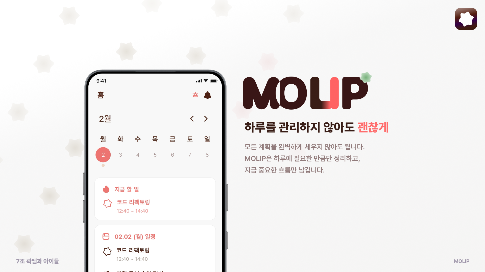

# 🚀 MOLIP — 팀 협업 플래너 & 스터디 앱

> 일정 관리, 실시간 채팅, 캠 스터디룸, 회고까지 — 팀의 모든 협업을 하나의 앱에서

## ✨ 멈춰 있던 하루를, 몰입으로 움직이세요

할 일은 많은데 무엇부터 시작할지 막막한 순간,
우리는 계획보다 결정에 더 많은 에너지를 쓰게 됩니다.

MOLIP은 하루의 할 일을 정리하고,
지금 가장 중요한 흐름만 남기도록 설계했습니다.

### AI는 정리하고, 사용자는 실행합니다

할 일을 입력하면 AI가 시간 흐름에 맞춰 자동 배치하고,
사용자는 필요할 때 직접 조정해 최종 결정을 내립니다.

MOLIP은 계획을 넘어,
결정을 줄이고 실행에 집중하게 만드는 플래너를 지향합니다.

---

## 📌 0. Overview

MOLIP은 대학생 팀 프로젝트 협업을 위한 올인원 플래너 앱입니다.
일정 계획, 실시간 채팅, 영상 스터디룸, 회고 작성 등 팀 운영에 필요한 기능을 하나의 앱에서 제공합니다.

- **서비스 URL**: https://molip.today



[](https://www.youtube.com/watch?v=nTxPmcUat0I)

---

## 👥 1. Development Info

### 👥 팀 구성

- FE, BE, AI, Design, PM 협업으로 진행한 팀 프로젝트

### 📆 개발 기간

- 2025년 12월 22일 ~ 2026년 03월 26일

| 단계                            | 기간 | 시작일     | 종료일     |
| ------------------------------- | ---- | ---------- | ---------- |
| 서비스 기획 및 주제 선정        | 2주  | 2025-12-22 | 2026-01-04 |
| 기능 요구사항 정의 및 화면 설계 | 2주  | 2026-01-05 | 2026-01-18 |
| V1 개발 및 테스트               | 3주  | 2026-01-19 | 2026-02-08 |
| V2 개발                         | 3주  | 2026-02-09 | 2026-03-01 |
| V3 개발                         | 3주  | 2026-03-02 | 2026-03-22 |
| 마무리 점검/배포 정리           | 4일  | 2026-03-23 | 2026-03-26 |

---

## 🛠️ 2. Tech Stack

### Core

| 항목            | 기술                                                    |
| --------------- | ------------------------------------------------------- |
| Framework       | Next.js 15 (App Router)                                 |
| UI Library      | React 19, React DOM 19                                  |
| Language        | TypeScript 5                                            |
| Styling         | Tailwind CSS 4, Emotion, `clsx`, `tailwind-merge`       |
| Server State    | TanStack Query 5, React Query Devtools                  |
| Client State    | Zustand 5                                               |
| Form            | React Hook Form, `@hookform/resolvers`, Zod             |
| UI 컴포넌트     | Radix UI (`@radix-ui/react-dialog`)                     |
| 인터랙션        | DnD Kit (`@dnd-kit/*`), `react-mobile-picker`           |
| 데이터 시각화   | Recharts                                                |
| 모션/애니메이션 | GSAP (`gsap`, `@gsap/react`), Motion, `canvas-confetti` |

### Realtime & Communication

| 항목        | 기술                                             |
| ----------- | ------------------------------------------------ |
| 실시간 채팅 | STOMP over WebSocket (`@stomp/stompjs`)          |
| 영상 통화   | LiveKit (`livekit-client`)                       |
| 푸시 알림   | Firebase FCM + Web Push (`firebase`, `web-push`) |
| PWA         | Workbox (`workbox-window`)                       |

### Infrastructure & DX

| 항목               | 기술                                                                                    |
| ------------------ | --------------------------------------------------------------------------------------- |
| 모니터링           | Sentry (`@sentry/nextjs`)                                                               |
| E2E 테스트         | Playwright (`@playwright/test`)                                                         |
| 성능 테스트        | Artillery                                                                               |
| 문서화             | Storybook (`storybook`, `@storybook/nextjs`)                                            |
| 의존성 검사        | Dependency Cruiser                                                                      |
| 코드 품질          | ESLint, Prettier, TypeScript                                                            |
| 경계/아키텍처 규칙 | `eslint-plugin-boundaries`, `eslint-plugin-import`, `eslint-import-resolver-typescript` |
| 훅/커밋 규칙       | Husky, Commitlint                                                                       |
| 번들 분석          | `@next/bundle-analyzer`                                                                 |

### Platform (Repo/Infra)

| 항목          | 기술                              |
| ------------- | --------------------------------- |
| CI/CD         | GitHub Actions + Jenkins + Docker |
| 이미지 호스팅 | AWS S3                            |

---

## 🎯 3. Design System

- 컴포넌트 기준: `src/shared/ui`
- 스타일/토큰 기준: `src/shared/styles`, Tailwind Theme
- 설계 원칙: 재사용성, 일관성, 접근성
- 문서/검증: Storybook 기반 컴포넌트 문서화 및 UI 확인

---

## 🧱 4. Architecture

### 현재 폴더 구조 (요약)

```text
.
├── .agents/
├── .claude/
├── .cursor/
├── .github/
├── .husky/
├── .idea/
├── .storybook/
├── .vscode/
├── 7-team-temporary-fe.wiki/
├── app/
│   ├── (protected)/
│   │   ├── home/
│   │   ├── chat/
│   │   │   ├── [roomId]/
│   │   │   ├── create/
│   │   │   └── search/
│   │   ├── room/
│   │   ├── retro/
│   │   └── profile/
│   ├── (public)/
│   │   ├── login/
│   │   ├── sign-up/
│   │   │   └── intro/
│   │   └── retro/
│   │       └── public/
│   │           └── [retroId]/
│   ├── api/
│   │   ├── _proxy/
│   │   ├── bff/[...path]/
│   │   ├── chat/[...path]/
│   │   ├── task/[...path]/
│   │   ├── example/
│   │   └── sentry-example-api/
│   ├── fonts/
│   ├── health/
│   └── sentry-example-page/
├── docs/
│   ├── common-domain/
│   ├── frontend-standard-structure/
│   └── images/
├── local-assets/
├── pages/
├── public/
│   └── icons/
├── scripts/
├── src/
│   ├── entities/
│   │   ├── auth/
│   │   ├── cam-study-room/
│   │   ├── chat-room/
│   │   ├── day-plan/
│   │   ├── day-plan-presence/
│   │   ├── day-plan-schedule/
│   │   ├── day-plan-schedule-core/
│   │   ├── friend/
│   │   ├── issue/
│   │   ├── notification/
│   │   ├── report/
│   │   ├── retro/
│   │   └── user/
│   ├── features/
│   │   ├── ai-arrange/
│   │   ├── auth/
│   │   ├── chat-room-create/
│   │   ├── chat-room-edit/
│   │   ├── chat-room-join/
│   │   ├── chat-room-leave/
│   │   ├── chat-room-session/
│   │   ├── friend/
│   │   ├── home/
│   │   ├── image/
│   │   ├── profile/
│   │   ├── report/
│   │   ├── retro/
│   │   ├── schedule/
│   │   └── task-basket/
│   ├── pages/
│   │   ├── app-shell/
│   │   ├── auth/
│   │   ├── friend/
│   │   ├── home/
│   │   ├── login/
│   │   ├── notification/
│   │   ├── profile/
│   │   ├── report/
│   │   ├── retro/
│   │   ├── room/
│   │   └── sign-up/
│   ├── shared/
│   │   ├── api/
│   │   ├── auth/
│   │   ├── device/
│   │   ├── firebase/
│   │   ├── form/
│   │   ├── hooks/
│   │   ├── lib/
│   │   ├── model/
│   │   ├── pwa/
│   │   ├── query/
│   │   ├── socket/
│   │   ├── styles/
│   │   ├── ui/
│   │   └── validation/
│   └── widgets/
│       ├── app-header/
│       ├── auth/
│       ├── chat-room-message-feed/
│       ├── chat-room-session/
│       ├── friend-list/
│       ├── home-planner/
│       ├── home-week/
│       ├── planner-edit/
│       ├── public-page-header/
│       ├── retro-feed/
│       ├── retro-public-feed/
│       ├── room-feed/
│       ├── stack/
│       ├── tab-stack/
│       └── task-basket/
├── tests/
│   ├── e2e/
│   └── load/
└── (build/output folders omitted: .git, .next, .pnpm-store, node_modules, test-results, tmp)
```

### BFF Proxy

`app/api/` 하위 API Routes가 백엔드 서버로의 프록시 역할을 수행합니다.
HTTP 요청은 BFF를 통해 프록시되며, WebSocket(STOMP)은 백엔드에 직접 연결합니다.

---

## 🎨 5. UI/UX 설계 포인트

### 실시간 채팅 STOMP 세션 관리

`chatStompSession` 싱글톤이 STOMP 연결을 관리합니다.
토큰 갱신·자동 재연결 시에도 구독 중인 채팅방이 유지됩니다.

### PWA 지원

Service Worker(Workbox)와 Firebase FCM을 통해 백그라운드 푸시 알림을 지원합니다.
`app/manifest.ts`로 웹 앱 설치를 지원합니다.

### 성능 최적화

- 공개 피드: `staleTime: 5분`으로 윈도우 포커스 시 불필요한 재요청 방지
- Retro 좋아요: `setQueriesData`로 `likes` 필드만 패치해 S3 이미지 재요청 방지
- React Query 구조적 공유(structural sharing)로 불필요한 리렌더링 방지

---

## ⚙️ 6. Features

### 홈 플래너

- 일별 일정 조회·생성·편집·삭제
- 드래그&드롭 일정 순서 변경 (`@dnd-kit`)
- AI 일정 자동 정렬
- 주간 뷰 제공

### 실시간 채팅

- STOMP 프로토콜 기반 실시간 메시지 송수신
- 채팅방 생성·검색·참여·나가기
- 읽지 않은 메시지 카운트 실시간 업데이트
- 메시지 전송 Optimistic UI 적용

### 캠 스터디룸

- LiveKit 기반 영상/음성 통화
- 참여자 목록 실시간 표시

### 회고 (Retro)

- 회고 작성·수정·삭제
- 공개 회고 피드 (ISR 적용)
- 회고 좋아요·공유

### 친구

- 친구 검색·추가·목록 조회

### 알림

- Firebase FCM 푸시 알림
- 앱 내 알림 목록

### 작업 바구니 (Task Basket)

- 완료되지 않은 일정 임시 보관

---

## 📐 7. Development Conventions

### 브랜치 전략

```
main → release/* → develop → feature/issue-{number}
```

### 커밋 컨벤션

`commitlint` + Husky로 커밋 메시지를 자동 검증합니다.

```
feat: Add user authentication
fix: Fix null pointer exception
refactor: Reorganize FSD layer structure
```

### 이슈·PR 자동화

AI 기반 이슈 자동 생성 파이프라인을 운영합니다.
LLM이 팀 컨벤션(에픽루트 → 에픽 → 서브이슈)에 맞춰 이슈 초안을 생성하면,
`scripts/create-issue.sh`가 GitHub API로 자동 반영합니다.

```bash
scripts/create-issue.sh \
  --milestone V2 \
  --project-url https://github.com/orgs/100-hours-a-week/projects/304
```

### 성능 측정

```bash
# HAR + React Profiler 데이터 수집
pnpm profile:collect -- --url http://localhost:3000/home --label "home-perf" --runs 3

# E2E 성능 테스트
pnpm test:e2e

# 부하 테스트
pnpm test:load:http
```
