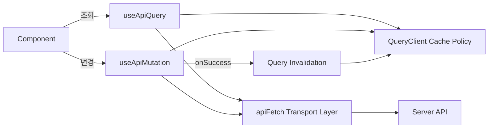
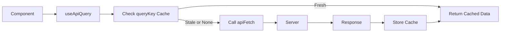
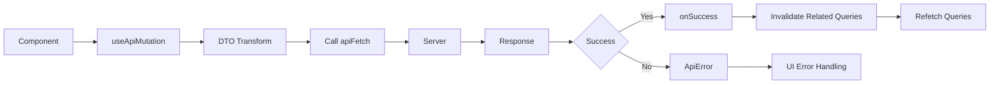

## 서버 상태 관리 정책 (TanStack Query Layer)

### 개요

- 서버상태를 정의하고 TanStack Query로 일관되게 관리한다.

### 주요 기능

- 전체 서버 상태 흐름도 : `컴포넌트 → useQuery / useMutation → apiFetch(Transport Layer)`
- 서버 상태 조회 및 변경의 **단일 진입점**
- **캐시 키(queryKey) 설계 규칙** 통일
- **cache / stale 정책 기준** 정의
- mutation 이후 캐시 **무효화(invalidation) 규칙**

### 서버 상태 접근 레이어

- `shared/api`
  - **주요 역할**: 서버 상태 조회 및 변경의 공통 진입점 제공
  - **포함 요소**:
    - `useApiQuery` (서버 상태 조회 공통 훅)
    - `useApiMutation` (서버 상태 변경 공통 훅)
    - `apiFetch` (HTTP Transport Layer)
  - **사용 위치**:
    - domain query / mutation 훅
    - **page hook**
- `shared/query`
  - **주요 역할**: 서버 상태 관리 패턴과 정책을 강제
  - **포함 요소**:
    - `queryKeyFactory` (queryKey 생성 규칙)
    - `useOptimisticMutation` (낙관적 업데이트 패턴 훅)
  - **사용 위치**:
    - domain mutation 훅

### 서버 상태 정책

#### queryKey

- 정책
  - **배열 기반 구조**를 사용한다.
  - 첫 번째 요소는 **도메인 단위 식별자**로 고정한다.
  - 두 번째 이후 요소는 **리소스 종류 및 파라미터**를 명시한다.

```tsx
["planner", "daily", date][("friend", "list")][("chat", "room", roomId)];
```

- **queryKeyFactory 사용**
  - queryKey는 문자열을 직접 작성하지 않고, 공통 `queryKeyFactory`를 통해 생성한다.

```tsx
export const plannerKeys = {
  all: ["planner"] as const,
  daily: (date: string) => [...plannerKeys.all, "daily", date] as const,
};
```

#### gcTime / staleTime 정책

- 사용자 인터렉션이 잦은 데이터: staleTime를 짧게하며 적극적인 invalidate
- 변경 주체 기준
  - 변경 주체가 사용자 본인인 데이터: 캐시를 신뢰하고 mutation 이후 명시적 invalidate로 정합성 유지
  - 변경 주체가 타 사용자 또는 시스템인 데이터: staleTime=0으로 항상 서버 재검증
- **전역 기본값(QueryClient)**
  - staleTime: 데이터가 오래 유지되는 것을 방지한다.

```tsx
const queryClient = new QueryClient({
  defaultOptions: {
    queries: {
      staleTime: 0, // 기본은 항상 stale
      gcTime: 1000 * 60 * 5, // 5분
      retry: 1, // 네트워크 오류만 1회
      refetchOnWindowFocus: false,
    },
  },
});
```

#### 에러 처리 정책

- 네트워크 / 인증 / 서버 에러는 **apiFetch**에서 구분하여 **Error로 throw**한다
- useApiQuery / useApiMutation은 **에러를 가공하지 않는다**
- **에러 해석 및 사용자 메시지 결정**은 **Page Hook** 또는 Page Component에서 수행한다

### 레이어별 구성 요소

#### apiFetch

- **apiFetch : Transport Layer**
- **설계 의도**
  - API Layer는 **요청과 응답만 처리**
  - 비즈니스 로직을 포함하지 않음
  - **상태 코드**를 기반으로 작성한다.
- **주요 기능**
  - **순수 I/O 계층**
  - HTTP 요청: GET POST PUT DELETE
  - HTTP 응답:
    - 요청 실패 시 HTTP status 기반으로 `ApiError`를 생성하여 throw
    - 요청 성공 시 response body를 JSON으로 파싱하여 반환
  - 인증 헤더, 에러 포맷, retry 정책 통일
    - token 존재 시 header에 Bearer 추가
    - method는 기본적으로 GET 요청
- `types.ts` : **api Response** 타입 정의

```tsx
export interface ApiResponse<T> {
  data: T;
  meta?: unknown;
}

export type HttpMethod = "GET" | "POST" | "PUT" | "PATCH" | "DELETE";
```

- `error.ts` : ApiError

```tsx
export class ApiError extends Error {
  status: number;

  constructor(status: number, message: string) {
    super(message);
    this.status = status;
  }
}
```

- Props & Interface

```tsx
interface RequestConfig<TBody> {
  method?: HttpMethod;
  body?: TBody;
  headers?: HeadersInit;
}
```

- 인증 헤더, 에러 포맷 통일
  - **API 성공 응답 구조**

```tsx
{
  status: "SUCCESS";
  message: "login_succeed";
  data: {
  }
}
```

- 요청 함수 예시

```tsx
const res = await fetch(url, {
  method,
  headers: {
    "Content-Type": "application/json",
    ...(token && { Authorization: `Bearer ${token}` }),
    ...headers,
  },
  ...(body && { body: JSON.stringify(body) }),
});
```

- 사용 파일 구조 예시

```tsx
shared/
 └─ api/
    ├─ apiFetch.ts        // fetch wrapper
    ├─ error.ts         // APIError 정의
    ├─ types.ts         // ApiResponse 타입
    └─ endpoints.ts
```

- **endpoint 형식 제어**
  - 주요 기능: **URL 문자열 생성을 담당**하며, 요청 방식(method, body)과 헤더 설정은 client(apiFetch)에서 결정한다.

```tsx
function path(endpoint) {
  return `${VITE_API_BASE_URL}${endpoint}`;
}

export const Endpoint = {
  USER: {
    LOGIN: path("/users/login"),
  },
  COMMENT: {
    POST: (postId) => path(`/posts/${postId}/comments`),
  },
};
```

#### useApiQuery

- **역할:** 서버 상태 조회
  - 조회 결과는 캐시에 저장되며, queryKey를 기준으로 공유된다.
  - 컴포넌트는 직접 fetch를 호출하지 않고 useQuery를 통해서만 서버 데이터를 조회한다.
- **props**

```tsx
interface UseApiQueryProps<TResult> {
  queryKey: readonly unknown[];
  url: string;
}
```

- `queryKey`
  - 서버 상태를 식별하는 유일한 키
  - 반드시 `queryKeyFactory`를 통해 생성한다.

```tsx
queryKey: plannerKeys.daily(date);
```

- `url`: 실제 서버 요청 endpoint

#### useApiMutation

- **역할:** 서버 상태 변경
  - **POST / PUT / PATCH / DELETE** 요청에 사용한다.
  - 서버가 최종 상태의 유일한 기준이기 때문에 클라이언트는 항상 **조회 결과로 상태를 확정**한다
  - 단, 즉각적인 UX가 필요한 경우에 한해 **제한적으로 낙관적 업데이트(useOptimisticMutation)를 허용**한다.
- **mutation & invalidation 정책**
  - mutation 성공 시, 관련 query만 명시적으로 invalidate
  - 전역 invalidate 사용금지
- **props**

```tsx
interface UseApiMutationProps<TForm, TDto, TResult> {
  url: string | ((form: TForm) => string);
  method: "POST" | "PUT" | "PATCH" | "DELETE";
  dtoFn?: (form: TForm) => TDto;
  onSuccess?: (data: TResult) => void;
  invalidateKeys?: Array<readonly unknown[]>;
}
```

- `url`: 실제 서버 요청 endpoint
- `method`:
  - 반드시 명시
  - GET 금지 (조회는 useQuery로만 처리)
- `dtoFn`:
  - form 데이터를 **API 요청 DTO**로 변환하는 함수
  - **UI form 구조**와 **API 스펙 분리**

```tsx
dtoFn: (form) => ({
  email: form.email,
  password: form.password,
});
```

- `onSuccess`:
  - **onSuccess**는 서버 요청 성공 이후의 도메인 단위 side-effect를 처리한다.
  - **UI 피드백(토스트, 모달 등)**은 Page Hook 또는 Page Component에서 처리한다.
- `invalidateKeys`:
  - mutation 성공 시 명시적으로 invalidate할 queryKey 목록

- **useApiMutation 함수 예시**

```tsx
export function useApiMutation({ url, dtoFn, method, onSuccess, invalidateKeys = [] }) {
  const queryClient = useQueryClient();

  return useMutation({
    mutationFn: async (form) => {
      const apiUrl = typeof url === "function" ? url(form) : url;
      const dto = dtoFn ? dtoFn(form) : undefined;

      return apiFetch(apiUrl, {
        method,
        body: dto,
      });
    },

    onSuccess: (data) => {
      invalidateKeys.forEach((key) => {
        queryClient.invalidateQueries({ queryKey: key });
      });
      onSuccess?.(data);
    },
  });
}
```

- **에러 토스트**는 사용처에서 처리한다. (예시코드)

```tsx
const mutation = useApiMutation({ ... });

useEffect(() => {
  if (mutation.isError) {
    addToast("요청에 실패했습니다.");
  }
}, [mutation.isError]);
```

#### useOptimisticMutation

- 역할: 낙관적 업데이트의 동작과 순서를 강제한다.
- **개요**
  - **적용 범위**
    - 기본적으로 invalidate(캐시 무효화) 기반 동기화
    - Optimistic Update는 예외적으로 허용하며, 적용 여부는 아래 조건을 만족해야 한다
  - **허용 조건**
    - **변경 대상이 단일 엔티티, 단일 필드** → 하나만 바뀐다 : 한 객체의 한 값 정도
    - **프론트에서 결과를 예측할 수 있다** → 서버가 복잡한 계산을 안 함
    - **실패하면 어떻게 되돌릴지 명확하다** → 이전 값이 분명해서 그대로 원복 가능
    - **영향받는 데이터가 많지 않다** → 어떤 query만 다시 불러오면 되는지 정확히 안다
- **useOptimisticMutation 인터페이스**
  - `mutationFn`: 실제 서버 요청
  - `queryKey`: optimistic update를 적용할 기준 캐시
  - `getOptimisticData`: 이전 캐시(previous) + 입력값(variables) → **임시 상태 계산**
  - `invalidateKeys`: 성공 후 반드시 invalidate할 query 목록

```tsx
interface UseOptimisticMutationProps<TVariables, TCache> {
  mutationFn: (variables: TVariables) => Promise<unknown>;
  queryKey: readonly unknown[];
  getOptimisticData: (previous: TCache | undefined, variables: TVariables) => TCache;
  invalidateKeys: readonly unknown[][];
}
```

- **구현 예시**

```tsx
export function useOptimisticMutation<TVariables, TCache>({
  mutationFn,
  queryKey,
  getOptimisticData,
  invalidateKeys,
}: UseOptimisticMutationProps<TVariables, TCache>) {
  const queryClient = useQueryClient();

  return useMutation({
    mutationFn,

    onMutate: async (variables) => {
      await queryClient.cancelQueries({ queryKey });
      const snapshot = queryClient.getQueryData<TCache>(queryKey);
      const optimistic = getOptimisticData(snapshot, variables);
      if (optimistic !== undefined) {
        queryClient.setQueryData(queryKey, optimistic);
      }
      return { snapshot };
    },

    onError: (_err, _vars, context) => {
      if (context?.snapshot !== undefined) {
        queryClient.setQueryData(queryKey, context.snapshot);
      }
    },

    onSettled: () => {
      invalidateKeys.forEach((key) => {
        queryClient.invalidateQueries({ queryKey: key });
      });
    },
  });
}
```

- **onMutate의 흐름**
  1. 관련 query를 cancel
  2. 기존 캐시 스냅샷 저장(**getQueryData**를 previous에 저장)
  3. 낙관적 데이터(optimistic) 생성 (**getOptimisticData**로 임시 상태 계산(이전 캐시 + 입력값))
  4. **setQueryData**로 낙관적 데이터(optimistic) **임시 반영**
- **onError**에서 반드시 **롤백(이전 캐시를 setQueryData)**한다
- **onSuccess**에서 서버 응답을 즉시 캐시에 직접 반영하지 않는다

→ onSettled 또는 onSuccess에서 반드시 **invalidate(무효화)** 한다

- 최종 상태는 **서버 기준으로 확정**한다

- **사용예시: 할일 토글 - 실행 순서**

```tsx
export function useToggleTodoDone(date: string) {
  return useOptimisticMutation<{ todoId: string }, DailyPlanner>({
    mutationFn: (vars) =>
      apiFetch("/api/todos/toggle", {
        method: "PATCH",
        body: vars,
      }),

    queryKey: plannerKeys.daily(date),

    getOptimisticData: (previous, vars) => {
      if (!previous) return previous as any;

      return {
        ...previous,
        todos: previous.todos.map((t) => (t.id === vars.todoId ? { ...t, isDone: !t.isDone } : t)),
      };
    },

    invalidateKeys: [plannerKeys.daily(date)],
  });
}
```

1. **사용자 액션**
   - 사용자가 할 일 완료 토글을 클릭한다
2. **mutation 실행**
   - `useToggleTodoDone`이 실행되며 `useOptimisticMutation`이 호출된다
3. **onMutate 단계**
   - 해당 날짜의 플래너 query를 cancel한다
   - 기존 캐시 데이터를 snapshot으로 저장한다
   - `getOptimisticData`를 통해 완료 상태를 즉시 토글하여 캐시에 반영한다
4. **서버 요청**
   - `mutationFn`을 통해 할 일 완료 상태 변경 요청을 서버에 전송한다
5. **에러 발생 시**
   - 요청이 실패하면 snapshot을 이용해 캐시를 이전 상태로 롤백한다
6. **요청 종료**
   - 성공/실패와 관계없이 관련 query를 invalidate 한다
7. **상태 확정**
   - invalidate된 query가 다시 fetch 되며 서버 기준 최신 상태가 캐시에 반영된다

### 전체 서버 상태 관리 흐름도

- 모든 서버 상태는 **Query Layer**를 통해 흐른다
- QueryClient는 정책 관리자
- apiFetch는 순수 Transport Layer



### 서버 상태 조회 흐름

- queryKey가 캐시의 정체성
- stale 판단은 Query가 수행



### 서버 상태 변경 흐름

- mutation은 캐시를 직접 수정하지 않는다
  - mutation 성공 후 관련 query를 invalidate
  - Query가 서버에서 최신 상태를 다시 가져온다
- 에러는 상태로 전달되고 UI에서 처리한다


