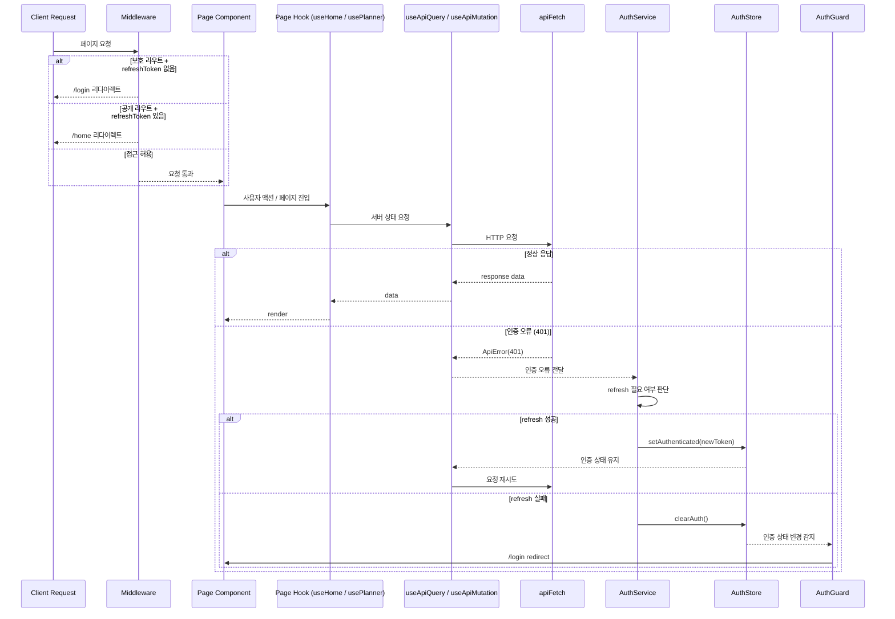
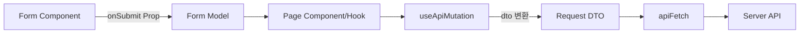
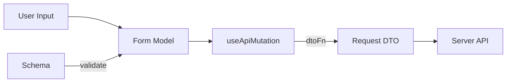
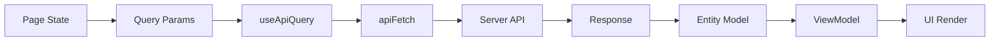
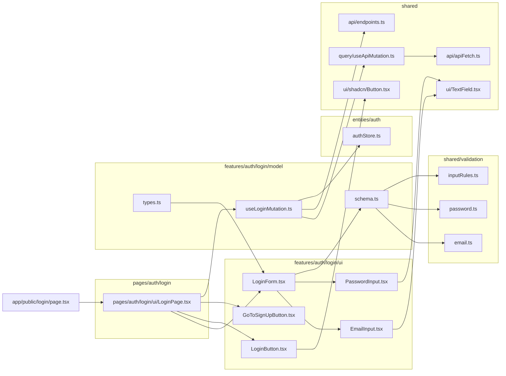
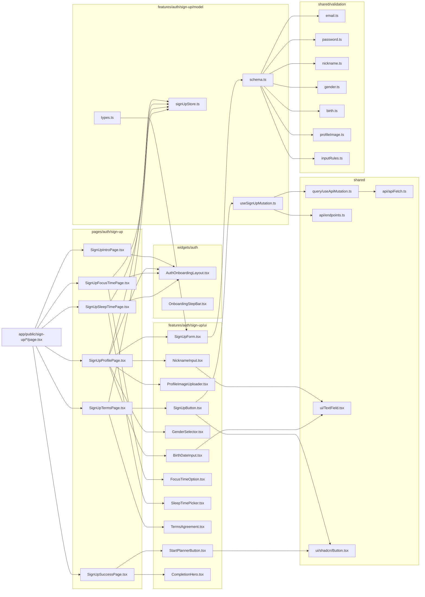

## 6. 라우팅 어댑터 구조

### 6.1 라우팅 책임 분리 원칙

- 보안의 최종 책임은 서버에 있으며, 프론트는 접근 제어를 보조한다.
- Next.js App Router를 라우팅/렌더링 엔트리로 사용한다.
- FSD Pages 레이어는 `src/pages` 디렉터리에서 관리한다.

### 6.2 page.tsx 설계 기준

- `app/**/page.tsx`는 라우팅 어댑터 역할만 수행한다.
- 실제 화면 구성과 비즈니스 조합 로직은 FSD Pages 레이어에 위치한다.

`app/example/page.tsx`

```tsx
import { ExamplePage } from "@/pages/example";

export default function Page() {
  return <ExamplePage />;
}
```

### 6.3 구조 매핑 기준

| 위치                            | 역할                            |
| ------------------------------- | ------------------------------- |
| `app/**/page.tsx`               | Next.js 라우팅 엔트리 (Shell)   |
| `src/pages/**`                  | 실제 페이지 UI 구성, 상태, 조합 |
| `src/widgets,features,entities` | 하위 레이어                     |

**로그인/로그아웃 폴더 아키텍처**

```text
.
|-- app
|   |-- layout.tsx
|   |-- providers.tsx
|   |-- globals.css
|   |-- error.tsx
|   |-- loading.tsx
|   |-- not-found.tsx
|   |-- api
|   |   `-- example/route.ts
|   |-- (public)
|   |   |-- login/page.tsx
|   |   `-- sign-up
|   |       |-- intro/page.tsx
|   |       |-- profile/page.tsx
|   |       |-- focus-time/page.tsx
|   |       |-- sleep-time/page.tsx
|   |       |-- terms/page.tsx
|   |       `-- success/page.tsx
|   `-- (protected)
|       |-- home/page.tsx
|       |-- planner
|       |   |-- edit/page.tsx
|       |   |-- todolist/page.tsx
|       |   `-- report/page.tsx
|       |-- chat
|       |   |-- page.tsx
|       |   |-- [roomId]/page.tsx
|       |   |-- search/page.tsx
|       |   `-- create/page.tsx
|       `-- retrospect
|           |-- page.tsx
|           |-- create/page.tsx
|           |-- public/page.tsx
|           `-- public/[reflectionId]/page.tsx
|-- pages
|   `-- README.md
|-- middleware.ts
|-- instrumentation.js
└── src/
    ├── entities/
    │   ├── user/
    │   │   ├── model/
    │   │   │   ├── types.ts          # User, UserProfile, UserResponse 등
    │   │   │   ├── schema.ts         # UserResponse schema (server response validation)
    │   │   │   └── index.ts
    │   │   ├── api/
    │   │   │   ├── user.api.ts       # GET/PATCH /users, nickname/email check
    │   │   │   └── index.ts
    │   │   └── ui/
    │   │       ├── UserAvatar.tsx
    │   │       └── index.ts
    │   └── auth/
    │       ├── model/
    │       │   ├── authStore.ts      # AuthState, setAuthenticated, clearAuth
    │       │   ├── types.ts          # AuthTokens, AuthState
    │       │   └── index.ts
    │       └── api/
    │           ├── token.api.ts      # POST/PUT/DELETE /token
    │           └── index.ts
    ├── features/
    │   └── auth/
    │       ├── login/
    │       │   ├── ui/
    │       │   │   ├── LoginForm.tsx
    │       │   │   ├── LoginButton.tsx
    │       │   │   ├── EmailInput.tsx
    │       │   │   ├── PasswordInput.tsx
    │       │   │   ├── GoToSignUpButton.tsx
    │       │   │   └── index.ts
    │       │   └── model/
    │       │       ├── types.ts        # LoginFormModel, LoginRequest
    │       │       ├── schema.ts       # Login form validation schema (optional)
    │       │       ├── useLoginMutation.ts
    │       │       └── index.ts
    │       ├── sign-up/
    │       │   ├── ui/
    │       │   │   ├── SignUpForm.tsx
    │       │   │   ├── SignUpButton.tsx
    │       │   │   ├── ProfileImageUploader.tsx
    │       │   │   ├── NicknameInput.tsx
    │       │   │   ├── GenderSelector.tsx
    │       │   │   ├── BirthDateInput.tsx
    │       │   │   ├── FocusTimeOption.tsx
    │       │   │   ├── SleepTimePicker.tsx
    │       │   │   ├── TermsAgreement.tsx
    │       │   │   ├── StartPlannerButton.tsx
    │       │   │   ├── CompletionHero.tsx
    │       │   │   └── index.ts
    │       │   └── model/
    │       │       ├── signUpStore.ts
    │       │       ├── types.ts        # SignUpFormModel, SignUpRequest
    │       │       ├── schema.ts       # SignUp form validation schema (optional)
    │       │       ├── useSignUpMutation.ts
    │       │       └── index.ts
    │       ├── guard/
    │       │   ├── ui/
    │       │   │   └── AuthGuard.tsx     # Client Guard UI wrapper
    │       │   └── model/
    │       │       ├── useRouteGuard.ts  # AuthStore 기반 라우팅 보정
    │       │       └── index.ts
    │       ├── logout/
    │       │   └── model/
    │       │       ├── useLogoutMutation.ts
    │       │       └── index.ts
    │       └── refresh/
    │           └── model/
    │               ├── useRefreshMutation.ts
    │               └── index.ts
    ├── widgets/
    │   └── auth/
    │       └── onboarding/
    │           └── ui/
    │               ├── AuthOnboardingLayout.tsx
    │               ├── OnboardingHeader.tsx
    │               ├── OnboardingStepBar.tsx
    │               ├── OnboardingHero.tsx
    │               ├── OnboardingStartButton.tsx
    │               └── index.ts
    │       └── sign-up/
    │           └── ui/
    │               ├── SignUpFlowLayout.tsx
    │               ├── SignUpStepHeader.tsx
    │               └── index.ts
    ├── pages/
    │   └── auth/
    │       ├── login/
    │       │   ├── ui/LoginPage.tsx
    │       │   └── index.ts
    │       └── sign-up/
    │           ├── intro/ui/SignUpIntroPage.tsx
    │           ├── profile/ui/SignUpProfilePage.tsx
    │           ├── focus-time/ui/SignUpFocusTimePage.tsx
    │           ├── sleep-time/ui/SignUpSleepTimePage.tsx
    │           ├── terms/ui/SignUpTermsPage.tsx
    │           ├── success/ui/SignUpSuccessPage.tsx
    │           └── index.ts
    └── shared/
        ├── api/
        │   ├── apiFetch.ts
        │   ├── error.ts
        │   ├── types.ts
        │   ├── endpoints.ts
        │   └── index.ts
        ├── query/
        │   ├── useApiQuery.ts
        │   ├── useApiMutation.ts
        │   ├── useOptimisticMutation.ts
        │   └── queryKeyFactory.ts
        ├── validation/
        │   ├── email.ts
        │   ├── nickname.ts
        │   ├── password.ts
        │   ├── gender.ts
        │   ├── birth.ts
        │   ├── profileImage.ts
        │   ├── inputRules.ts
        │   └── index.ts
        ├── ui/
        │   ├── shadcn/
        │   ├── TextField.tsx
        │   └── index.ts
        ├── lib/
        ├── config/
        └── styles/

```

### 6.4 구조 흐름 기준

- Page: UI 구성/이벤트 바인딩만 담당한다. 데이터 조합 로직을 포함하지 않는다.
- Page Hook: 화면에 필요한 Query/Mutation을 조합하고 View Model을 반환한다.
- Query Layer: 서버 상태는 `useApiQuery / useApiMutation`으로만 접근한다.
- Transport Layer: 네트워크 요청은 `apiFetch` 단일 진입점으로 통일한다.
- Auth 해석: 인증 오류 해석은 `AuthService`가 담당하고, 상태 변경은 `AuthStore`가 담당한다.
- Guard: 라우팅 보정은 AuthGuard가 수행한다.

```
Page Component → Page Hook (useHome, usePlanner 등)
→ useApiQuery / useApiMutation
→ apiFetch (← HTTP 에러 발생) → (AuthService가 해석)
→ AuthStore 상태 변경 → AuthGuard 반응
```

### 6.5 요청 진입 표준 (Middleware 포함)

- Middleware는 RT 쿠키 존재 여부로 접근을 1차 제어한다.
- 공개/보호 라우트 정책은 Route Group 기준으로 구분한다.
- UI 보정은 AuthGuard가 수행한다.



### 6.6 폼/모델/DTO 분리 기준

- Form Component는 입력/검증을 담당하고 Form Model을 전달한다.
- Form Model과 Request DTO는 `features/*/model/types.ts`에서 정의한다.
- DTO 변환은 feature model의 mutation(`useApiMutation`의 dtoFn)에서 수행한다.
- 서버 응답은 Query 캐시에 저장되고 UI는 캐시 기반으로 갱신한다.



#### 6.6.1 입력 흐름 (Schema/Model/DTO 관계)

- **Schema**: Form Model의 입력 규칙을 검증한다. (resolver 또는 RHF rules에 연결)
- **Form Model**: UI 입력 상태의 구조이다. Form Component가 생성/관리한다.
- **Request DTO**: 서버로 전달되는 payload다. mutation의 `dtoFn`에서 Form Model을 변환한다.



#### 6.6.2 조회 흐름 (Query/Response/ViewModel 관계)

- **Query Params**: 화면 상태에서 필요한 조회 파라미터를 구성한다.
- **useApiQuery**: queryKey + endpoint를 기준으로 서버 상태를 조회한다.
- **Response Model**: 서버 응답은 entities 모델(schema)로 검증한다.
- **ViewModel**: 응답 데이터를 화면에 필요한 형태로 매핑한다.



### 6.7 의존 흐름 문서화 기준

- 표기 순서: page → feature ui → feature model → (entities / shared: api, query, validation).
- 레이어 역참조가 보이면 구조 위반으로 간주한다.

#### 6.7.1 로그인 화면 플로우



#### 6.7.2 회원가입 화면 플로우



- 회원가입 입력 모델예시 (features/auth/sign-up/model/types.ts)

  ```tsx
  interface SignUpFormModel {
    email: string;
    password: string;
    nickname: string;
    gender: "MALE" | "FEMALE";
    birth: string; // YYYY.MM.DD
    focuseTimeZone: "MORNING" | "AFTERNOON" | "EVENING" | "NIGHT";
    dayEndTime: string; // HH:MM
    profileImageKey?: string;
  }
  ```

#### 6.7.3 검증 구성 기준

- 정의 위치
  - Form Model 타입: `features/*/model/types.ts`
  - Schema: `features/*/model/schema.ts` (필요 시에만)
  - 공통 규칙: `shared/validation/*`
- 구성 흐름
  - type 구조에 맞춰 schema를 작성하고, resolver로 폼에 연결한다.
  - schema를 쓰지 않으면 RHF rules로 폼에서 직접 검증한다.
- 적용 규칙
  - zod/yup + resolver를 쓰는 경우에만 `schema.ts`를 둔다.
  - 공통 규칙이 필요하면 `shared/validation/*`을 재사용한다.
  - 동일 필드의 검증 규칙은 중복 정의하지 않는다.
- 폼 처리 기준
  - `useForm()`은 페이지/폼 최상단에서 초기화한다.
  - 복합 폼은 하위 컴포넌트로 분리하고 `useFormContext`/`Controller`로 연결한다.
  - 입력 컴포넌트는 입력 값을 소유하지 않고 폼 컨텍스트에서 제어한다.
- 유효성 검사 트리거
  - 기본 트리거는 `onBlur`로 통일하고, 제출 시 `handleSubmit`에서 최종 검증한다.
  - 서버 검증 실패는 필드 오류 또는 전역 피드백으로 노출한다.

---
