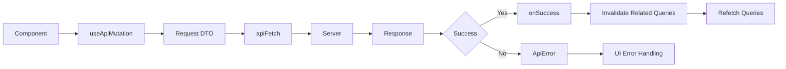

## 7. 상태 관리 구조

### 7.1 서버 상태 관리 전략

- 도입 라이브러리: TanStack Query
- 책임 범위: 캐싱·동기화·재시도·무효화
- 서버 데이터는 반드시 Query Layer를 통해서만 접근한다.
- 서버 상태 조회/변경은 `useApiQuery / useApiMutation` 단일 진입점으로 통일한다.
- queryKey는 배열 구조를 사용하며 `queryKeyFactory`를 통해 생성한다.
- mutation 성공 후에는 관련 query만 명시적으로 invalidate한다. (전역 invalidate 금지)
- mutation은 캐시를 직접 수정하지 않고, 성공 후 invalidate → refetch로 최신 상태를 동기화한다.
- 에러는 상태로 전달되고 UI에서 처리한다.

#### 서버 상태 변경 흐름

### 7.2 전역 UI 상태 관리 전략

- 도입 라이브러리: Zustand
- 사용 기준: UI 제어 목적(인증 상태, 모달 등)에 한정한다.

### 7.3 상태 간 책임 경계

- 로컬 컴포넌트 상태는 React state로 관리한다.
- 하나의 상태 관리 도구로 모든 것을 해결하려 하지 않는다.
- 비즈니스 데이터의 단일 진실 소스는 서버로 유지한다.
- apiFetch는 HTTP 상태를 기준으로 `ApiError`를 throw하고, 인증 오류는 `AuthService`가 해석한다.
- 일반 오류는 Page/Hook에서 처리한다.
- 낙관적 업데이트는 `useOptimisticMutation`으로만 제한적으로 허용한다.

---
