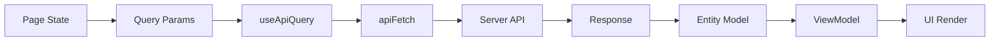

## 조회 흐름 (Query/Response/ViewModel)

이 문서는 `useApiQuery` 기반의 조회 흐름과 Response Model, ViewModel 분리 원칙을 정리한다.

### 흐름 요약

- **Query Params**: 화면 상태에서 필요한 조회 파라미터를 구성한다.
- **useApiQuery**: `queryKey` + `endpoint`를 기준으로 서버 상태를 조회한다.
- **Response Model**: 서버 응답은 entities 모델(schema)로 검증한다.
- **ViewModel**: 응답 데이터를 화면에 필요한 형태로 매핑한다.

### 데이터 흐름



### 구조 예시

```text
entities/
└─ planner/
   └─ model/
      ├─ schema.ts        # 서버 응답 검증
      └─ types.ts         # Response 타입
features/
└─ planner/
   └─ model/
      ├─ types.ts         # ViewModel 타입
      └─ usePlannerQuery.ts
pages/
└─ planner/
   └─ ui/PlannerPage.tsx
```

### ViewModel 매핑 예시

```tsx
import { useApiQuery } from "@/shared/query";
import { plannerKeys } from "@/shared/queryKeys";
import { Endpoint } from "@/shared/api";
import { PlannerResponseSchema } from "@/entities/planner/model/schema";
import type { PlannerViewModel } from "@/features/planner/model/types";

function toPlannerViewModel(response: unknown): PlannerViewModel {
  const parsed = PlannerResponseSchema.parse(response);
  return {
    id: parsed.id,
    title: parsed.title,
    items: parsed.items,
  };
}

export function usePlannerQuery(date: string) {
  return useApiQuery<PlannerViewModel>({
    queryKey: plannerKeys.daily(date),
    url: Endpoint.PLANNER.DAILY(date),
    // queryFn 내부에서 response → ViewModel 변환을 수행하는 구조로 확장 가능
  });
}
```

### 참고

- 서버 응답 타입과 화면 모델 타입은 분리한다.
- `queryKey`는 `queryKeyFactory` 기반으로 생성한다.

## 제네릭 타입 해석 (useApiQuery<T>)

`useApiQuery<T>`의 `T`는 **“컴포넌트에서 받는 타입”**이 아니라 **“Query 캐시에 저장되는 Response 타입”**을 선언하는 것이다.

```ts
useApiQuery<UserResponse>({
  queryKey: ["user", "me"],
  url: "/users/me",
});
```

위 코드는 **`useQuery<UserResponse>(...)`와 동일한 의미**이며, 아래 흐름을 가진다.

```
/users/me 응답
   ↓
Query Cache["user","me"]
   ↓
타입: UserResponse
```

### 핵심 포인트

- `T`는 **네트워크 boundary 타입**이자 **서버 상태의 스키마**다.
- “UserResponse를 받는다”가 아니라 “**UserResponse 형태로 캐시에 저장된다**”가 정확한 표현이다.

### 올바른 사고 흐름

- “이 쿼리 키에 저장되는 **서버 상태의 타입**은 무엇인가?”
- 그대로 쓰면 직결, 가공하면 `select` 또는 별도 모델 변환으로 분리한다.

### 이 구조가 좋은 이유

1. **Query Cache = 서버 상태 저장소**
2. 타입은 **저장 시점에 고정**
3. 읽는 쪽은 **그 타입을 신뢰**

이 원칙이 깨지면 캐시 무결성과 invalidate/refetch 시점에서 타입 혼란이 발생한다.
